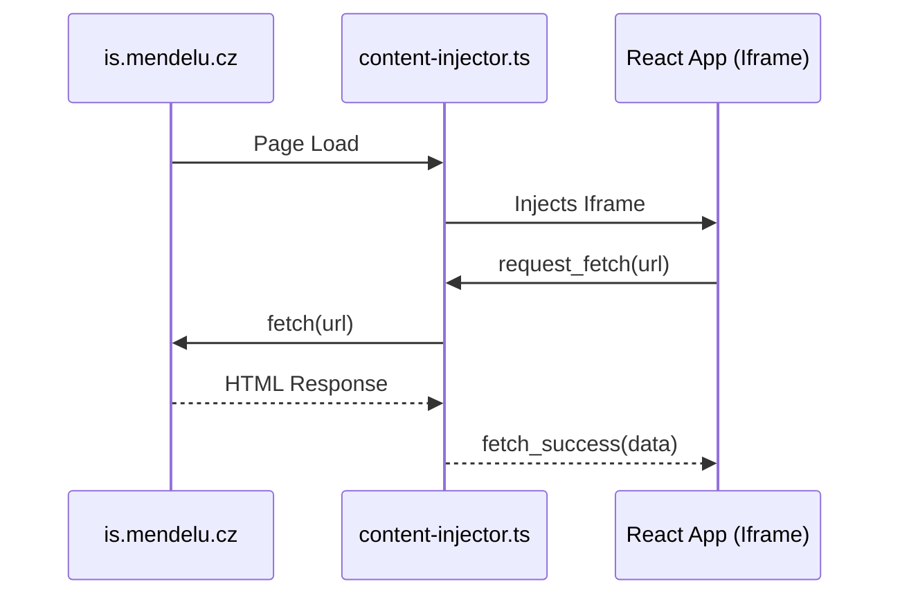

# REIS Architectural Deep-Dive

This document details the technical architecture of the REIS extension.

## 1. Iframe-Based Isolation

Unlike traditional extensions that inject DOM elements directly into the page, REIS uses an **Iframe wrapper**.

### Why?
- **CSS Encapsulation**: Avoids style leakage from `is.mendelu.cz`.
- **JS Sandbox**: Prevents interference with the host page's scripts.
- **Ease of Development**: Allows standard React development with modern tooling (Vite, HMR).

### Message Bridge
Communication between the host page (Content Script) and the React App (Iframe) happens via `window.postMessage`:

## 2. Data Flow & Scrapers

Data fetching follows a specialized pipeline to ensure reliability and speed.

- **ProxyClient**: Centralized fetch wrapper that handles authentication and CSRF tokens.
- **Parsers**: Pure functions that transform raw HTML into typed JSON objects.
- **StorageService**: Persists data to `chrome.storage.local` with encryption/hashing.
- **Hooks**: React hooks (`useExams`, `useSchedule`) provide a reactive interface to the data.

## 3. The Trinity Protocol

We enforce architectural integrity through automated and manual checks via three specialized agent personas:

- **@arch-guardian**: Enforces the **250-Line Rule** and structural hygiene.
- **@seymour-cash**: Validates data integrity and ensures scrapers aren't "hallucinating" data.
- **@safety-officer**: Manages the "Margin of Safety" (risk mitigation and error handling).

## 4. UI System

- **Vanilla CSS + Tailwind**: High performance, utility-first styling.
- **DaisyUI**: Semantic component classes (e.g., `btn-primary`) for consistent theming.
- **Inter Font**: Custom typography for a premium, modern feel.
